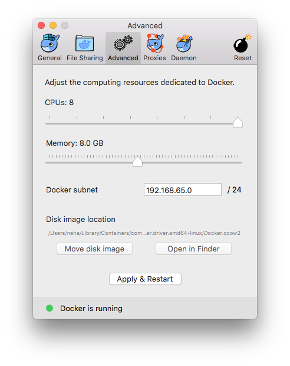
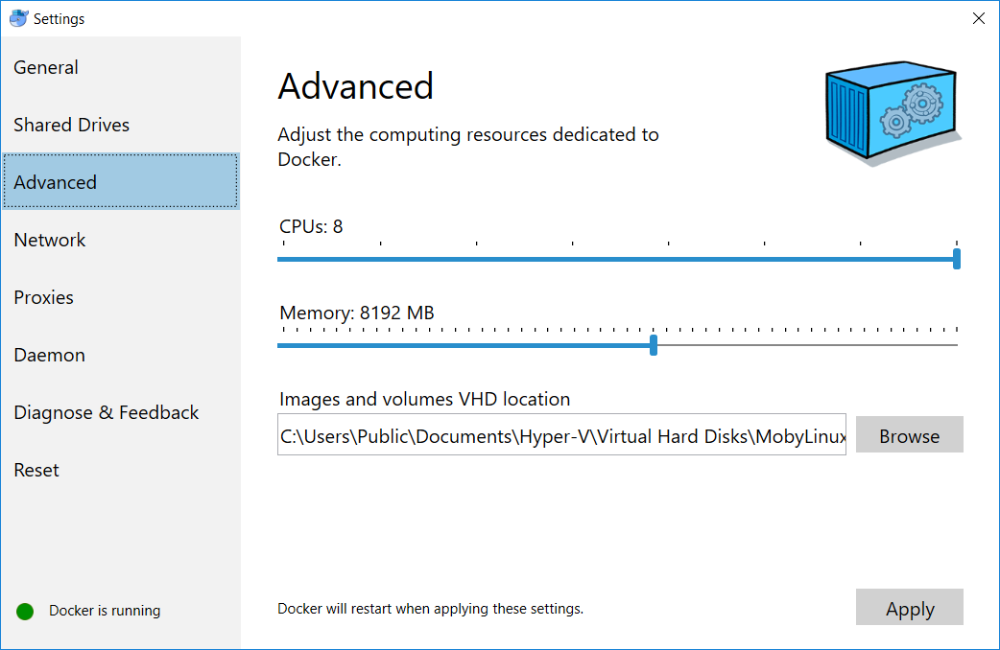

# Getting started

* [Installation](#installation)
  * [Prerequisites](#prerequisites)
    * [Mac OS](#mac-os)
    * [Windows](#windows)
    * [Linux](#linux)
  * [Downloading the AMP CLI](#downloading-the-amp-cli)
* [Creating a cluster](#creating-a-cluster)  
  * [Creating an AMP cluster locally](#creating-an-amp-cluster-locally)
  * [Creating an AMP cluster on AWS](#creating-an-amp-cluster-on-aws)
* [Deploying stacks](#deploying-stacks)    
* [Using the development version](#using-the-development-version)

## Installation

### Prerequisites

We recommend installing the Docker CE stable channel release 17.09 on your system.
Make sure you check the `What to know before you install` section on the Docker site for Mac OS and Windows to ensure your system meets the requirements.
 * [What to know before you install - Docker for Mac](https://docs.docker.com/docker-for-mac/install/#what-to-know-before-you-install)
 * [What to know before you install - Docker for Windows](https://docs.docker.com/docker-for-windows/install/#what-to-know-before-you-install)
 
> NOTE: We currently do not support Docker Toolbox on any OS.

#### Mac OS

> NOTE: Please use the edge version for Mac.

For the installers, go to [Docker for Mac](https://docs.docker.com/docker-for-mac/install/).

Configure Docker to use maximum CPU and at least half of the maximum memory. You can configure settings by right clicking the whale icon on the status bar and clicking `Preferences` -> `Advanced`. 
Make sure you apply these changes for Docker to be configured with the new settings. 

Here is a sample Docker configuration on Mac OS.

 <p align="center">
   
 </p>

#### Windows

For the installers, go to [Docker for Windows](https://docs.docker.com/docker-for-windows/install/).

Configure Docker to use maximum CPU and at least half of the maximum memory. You can configure settings by right clicking the whale icon in the Notifications area and clicking `Settings` -> `Advanced`.
Make sure you apply these changes for Docker to be configured with the new settings. 

Here is a sample Docker configuration on a Windows machine.

 

#### Linux

You can find specific Linux distribution in the tables on [Docker for Linux](https://docs.docker.com/engine/installation/).

### Downloading the AMP CLI

Download the latest release of the CLI for your platform from [here](https://github.com/appcelerator/amp/releases).
Place the `amp` binary from the release archive into some location in your system path. 

For example:
```
$ sudo chmod +x ./amp
$ sudo mv ./amp /usr/local/bin
```

## Creating a cluster

#### Creating an AMP cluster locally

See the [local cluster documentation](localcluster.md) for detailed information on cluster creation on your local machine.

#### Creating an AMP cluster on AWS

See the [AWS cluster documentation](awscluster.md) for detailed information on cluster creation on AWS.

## Deploying stacks

See the [stack deploy documentation](stackdeploy.md) for detailed information on deploying your own stacks on your AMP cluster.

## Using the development version

Alternatively, if you wish to work with the latest development version directly from `master` on Github,
you can fork the repo and build your own CLI. The entire toolchain has been containerized so you only need to install Docker.

> TIP: Here is the official [Go documentation](https://golang.org/doc/code.html#Workspaces) explaining how to create a Go project structure and set GOPATH. 

To get the repo setup, you can run the following set of commands to clone the repository into your `go` workspace and add the CLI path to your system `PATH`.

```
$ cd $GOPATH/src
$ mkdir -p github.com/appcelerator
$ cd github.com/appcelerator
$ git clone https://github.com/appcelerator/amp
$ cd amp
$ export PATH=$GOPATH/src/github.com/appcelerator/amp/bin/{YourOS}/amd64:$PATH
```

To build the CLI and the core AMP images, you can then run:
```
$ ampmake build
```
This will build cross-compiled versions of the CLI and place them in the appropriate locations under `./bin`.
In addition, this will build the development versions of each of the images necessary for creation of the AMP cluster.


> NOTE: For detailed information on AMP commands, see the [reference documentation](reference) for each command. 
