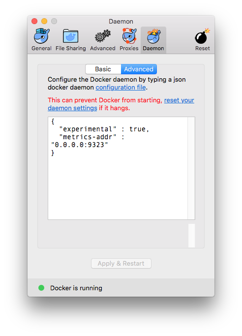
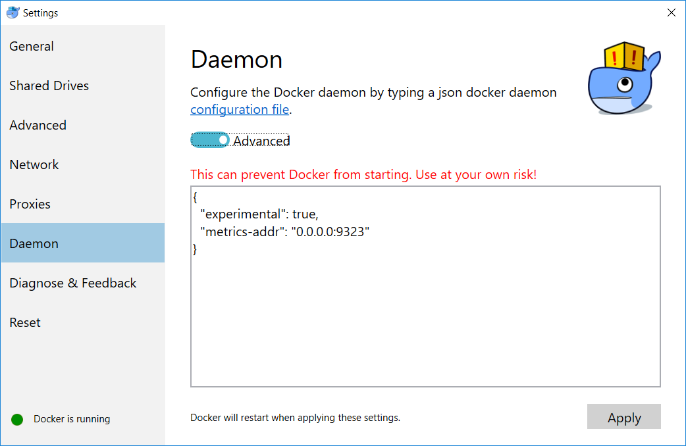

# Local cluster creation

This is the default mode for cluster creation on AMP. 

## Why do you need a local cluster?

During development of your application, you will want to have a quick and easy way of running and tearing down a cluster, rather than relying on a cloud based solution. 

## Prerequisites

### Mac OS

To enable Docker engine metrics, you must add some configuration to the Docker daemon. 

Right click on the whale icon, go to `Preferences` -> `Daemon` and select the `Advanced` tab, and add this:
```
{
    "experimental" : true,
    "metrics-addr" : "0.0.0.0:9323"
}
```
Make sure you apply these changes for Docker to be configured with the new settings. 

<p align="center">
   
 </p>
  
### Windows

To enable Docker engine metrics, you must add some configuration to the Docker daemon. 

You can configure settings by right clicking the whale icon in the Notifications area and clicking `Settings` -> `Daemon` -> `Advanced` tab.
```
{
    "experimental" : true,
    "metrics-addr" : "0.0.0.0:9323"
}
```
Make sure you apply these changes for Docker to be configured with the new settings. 



### Linux

To enable Docker engine metrics, you must add some configuration to the Docker daemon.  

Edit or create the `daemon.json` file in located `etc/docker` to include:
```
$ sudo nano /etc/docker/daemon.json
{
    "experimental" : true,
    "metrics-addr" : "0.0.0.0:9323"
}
```

You must perform this additional step to increase virtual memory needed for Elasticsearch.
```
$ sudo sysctl -w vm.max_map_count=262144
```

To make this change permanent, you can run the following and reboot:
```
$ echo "vm.max_map_count = 262144" | sudo tee -a /etc/sysctl.conf
```

## Cluster Deployment

To create a cluster locally:
```
$ amp cluster create
...
2017/12/04 01:17:59 ampctl (version: 0.18.0-dev, build: a51daf88)
...
{"Swarm Status":"active","Core Services":17,"User Services":0}

```
This will create a single node swarm cluster on your machine and deploy AMP services on top of it.

Once you have started a local cluster, you will be able to deploy stacks and monitor the associated services by signing up.
```
$ amp user signup --name user1 --email user1@amp.com --password [password]
Verification is not necessary for this cluster.
Hi user1! You have been automatically logged in.
```

> NOTE: See the [user](reference/user.md) documentation for additional details about the user account related operations.

With the local cluster, you do not need to verify the account created and you will be logged in automatically after an account creation. 

While deploying a local cluster, the default certificate is self-signed. You need to use the `-k` or `--insecure` option when using any of the AMP commands. 

> TIP: Set an alias for `amp` as `alias amp='amp -k'`. 
  
## What's next?

You can now deploy a stackfile on your newly created local cluster. Please follow the instructions listed [here](stackdeploy.md).

## Cluster Status

You can check if a cluster is running or not by running the following command: 
```
$ amp cluster status
``` 

The output of this command displays the provider, swarm status, and the number of core and user services running.
```
Provider:      local
Swarm Status:  active
Core Services: 17
User Services: 0
```

> NOTE: You must be logged in to the AMP cluster to run this command.

## Cluster Teardown

If you no longer use the deployed cluster, it can be removed by running the following command:

```
$ amp cluster rm
```

On success, the output looks something like this:
```
2017/12/08 21:49:40 ampctl (version: 0.18.0-dev, build: 4ad78fdd)
Removing service amp_agent
Removing service amp_alertmanager
Removing service amp_ampbeat
Removing service amp_amplifier
Removing service amp_cadvisor
Removing service amp_docker-engine
Removing service amp_elasticsearch
Removing service amp_etcd
Removing service amp_gateway
Removing service amp_grafana
Removing service amp_haproxy_exporter
Removing service amp_kibana
Removing service amp_nats
Removing service amp_nats_exporter
Removing service amp_nodes
Removing service amp_prometheus
Removing service amp_proxy
2017/12/08 21:49:40 waiting for all services to clear up...
2017/12/08 21:49:40 Removing container /amp_ampbeat.1.rwh3rnmwpf94rasrcah5hunk1 [Exited (1) 10 minutes ago]
2017/12/08 21:49:52 Removing container /amp_prometheus.1.bj1g2byp3te34sjov0rlz6gos [Exited (0) 9 seconds ago]
2017/12/08 21:49:52 Removing container /amp_nats_exporter.1.mv8lgp1c3jqm3ng009izh3oak [Exited (143) 9 seconds ago]
2017/12/08 21:49:55 Removing container /amp_agent.7z8aobvghzadvrb8n3zf22ake.pinz6oz4mk2m6y8h47455nrxk [Exited (137) 3 seconds ago]
2017/12/08 21:49:56 cleared up
2017/12/08 21:49:56 Removing volume [amp_etcd-data]...
2017/12/08 21:49:56 Removing volume [amp_ampagent]...
2017/12/08 21:49:56 Removing volume [amp_elasticsearch-data]...
2017/12/08 21:49:56 Removing volume [amp_prometheus-data]...
2017/12/08 21:49:56 Removing volume [amp_alertmanager-data]...
2017/12/08 21:49:56 Removing volume [amp_grafana-data]...
2017/12/08 21:49:56 Successfully removed network public [prn2d38x4q90vq3vqhejcb2h5]
2017/12/08 21:49:56 Successfully removed network monit [ik9ojg3hh5t2gdjv96s098cis]
2017/12/08 21:49:56 Successfully removed network core [zfc7cios4kmz4ogdknu5mrd2k]
2017/12/08 21:49:58 cluster deleted
```

> TIP: Use `-h` or `--help` option for any of the AMP commands or sub-commands to more information about the command's usage.
