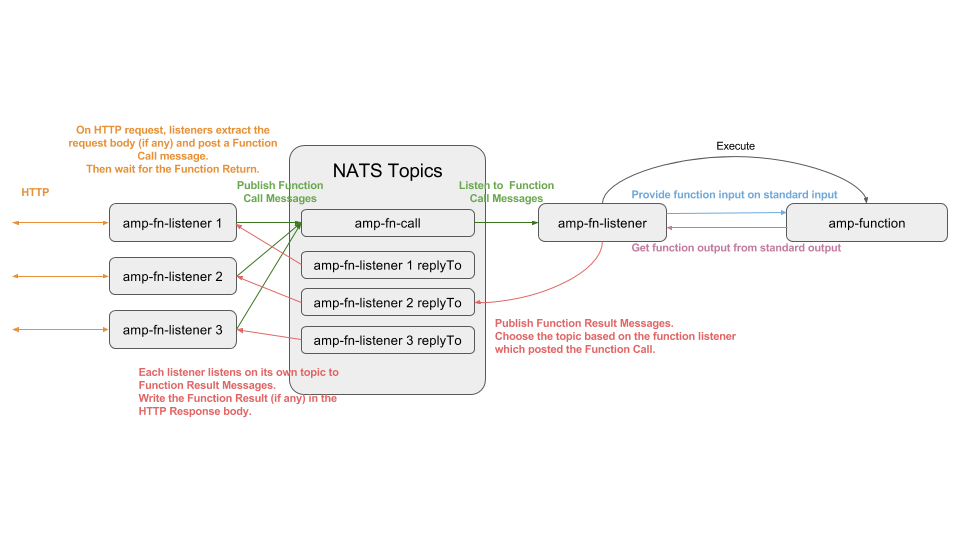

# Serverless computing

AMP now features a draft version of serverless computing which we refer to as `functions`.

## What are amp functions ?

AMP functions are based on FaaS (Function as a Service) principles. By using amp `functions`, you can:

* Write your function in any language
  * Go, Node.JS, Java, C, C++, shell, COBOL, you name it!
* Wrap it inside a container
* Invoke it
  * Via HTTP
  * Via amp CLI
* amp `functions` infrastructure is written in [Go](https://golang.org)

## Getting started

Here are the steps needed to run your amp `function`:

## Write your function
In order to keep a maximum of flexibility on the technology used for functions, standard streams are used to pass function input and output parameters:
 - `stdin` : where the function gets its input parameter
 - `stdout`: where the function can produce a result
 - `stderr`: where the function logs

Here is what a typical amp `function` look like:
```
package main

import (
	"fmt"
	"io/ioutil"
	"log"
	"os"
	"strings"
)

func main() {
	input, err := ioutil.ReadAll(os.Stdin)    // Get the input parameter from the standard input
	if err != nil {
		log.Fatal("Unable to read standard input", err)
	}
	log.Println("input", string(input))       // Logs on standard error
	fmt.Println(strings.Title(string(input))) // Write the function output on the standard output
}
```
The source code of this demo function is available here: [amp-demo-function](https://github.com/appcelerator/amp/tree/serverless-proto/examples/functions/demo-function)

## Wrap your function inside a container

Now that your function is available, you need to wrap it inside a container. There are no prerequisites for your container. You can use the base image you want, the language you want, etc. The only contract is:

* Your function container will be created and run on invocation,
* Input data will be passed through standard input
* Function result will be read from standard output

And that's it!

Here is the Dockerfile we use for the above demo function:
```
# golang:alpine provides an up to date go build environment
FROM golang:alpine
RUN apk --no-cache add make
WORKDIR /go/src/github.com/appcelerator/amp-demo-function
COPY . /go/src/github.com/appcelerator/amp-demo-function
RUN make
ENTRYPOINT []
CMD [ "/go/bin/amp-demo-function"]
```

Build your container with the following command:

    $ docker build -t appcelerator/amp-demo-function examples/functions/demo-function


## Register your function
In order to register your function against amp, you need to run the following command:

    $ amp fn create test appcelerator/amp-demo-function

## Invoke your function via HTTP
In order to invoke a function, you can POST an HTTP request to `localhost:4242/<function>` (to be changed). Calls block until the function sends a response.
Invoke your test function like this:

    $ cat Makefile | curl localhost:4242/test --data-binary @-

# Architecture

Amp `functions` rely on 2 amp services:
 - `amp-function-listener`
 - `amp-function-worker`

## `amp-function-listener`
- listen to HTTP events and send function request to NATS
- listen to NATS for function responses

## `amp-function-worker`
 - listen to NATS events,
 - spawn container
 - pass the content of the message through standard input
 - get the response as standard output (if any)
 - post the response back to NATS

## `amplifier`
The `function` API is served by `amplifier` and function information are stored in etcd. You can add, list and remove `function`s dynamically.

## `amp` CLI
`amp` CLI now supports `function`s commands:

 - create a function
 - list functions
 - remove a function

```
Usage:  amp function COMMAND

function operations

Aliases:
  function, fn

Options:
      --config-used         Display config file used (if any)
  -h, --help                Display help
      --server string       Server address
      --use-config string   Specify config file (overrides default at $HOME/.config/amp/amp.yaml)
  -v, --verbose             Verbose output
  -V, --version             Version number

Commands:
  create      Create a function
  ls          List functions
  rm          Remove a function
```

# Observations
 - We probably shouldn't use NATS-streaming but NATS directly (without storage) since we probably don't want to store all functions request and responses.
 - We can have a better NATS usage if we know beforehand whether or not the function produces a return value (fire and forget)